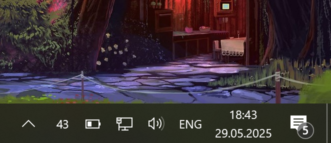

# Battery Fella

This utility adds a system tray battery percentage indicator on Windows.

## Installation

- Copy Battery Fella to `AppData` or wherever you like.
- Run `batteryfella.exe`.
- Drag the tray icon to the task bar so that it stays there if it's hidden.

## Features

- **Completely seamless** - the proram is designed to mimic the style of Windows and looks jsut like any other system icon.
- **HiDPI support -** will look good regardless of DPI.
- **Low battery alarm** - If you keep forgetting to charge your battery, Simple Battery Display will remind you when
  your battery drops below a certain percentage.
- **Custom fonts** - if you don't like the default look, you can design your own font.
